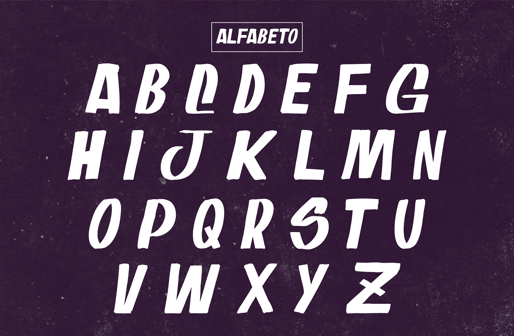

# Oferta Do Dia Font

**Oferta Do Dia** is a vernacular typeface inspired by the expressive hand-painted signs found in local grocery stores and street markets across Brazil.  
This font was originally created as part of an academic project for the **Layout and Typography** course.


## ✏️ About the Typeface

The font captures the spontaneous and bold nature of Brazilian commercial lettering — often seen in discount signs, price boards, and colorful storefront ads.  
It is playful, bold, and ideal for eye-catching layouts that need personality and impact.

You can find the font file in the [`fonts`](./fonts) folder:

- `Oferta-do-Dia.ttf`

## Letters



## 💻 How to Use

You can embed the font in your website using CSS:

```css
@font-face {
  font-family: 'Oferta do Dia';
  src: url('https://raw.githubusercontent.com/fguisso/Oferta-do-Dia/refs/heads/main/fonts/Oferta-do-Dia.ttf') format('truetype');
  font-weight: normal;
  font-style: normal;
}

body {
  font-family: 'Oferta do Dia', sans-serif;
}
```

> ⚠️ Please note: GitHub is not optimized for serving web fonts in production. For better performance and reliability, consider hosting the font on your own web server.


## 🙌 Credits

Designed by [Eduardo Lopes](https://www.behance.net/eduardolrs)  
